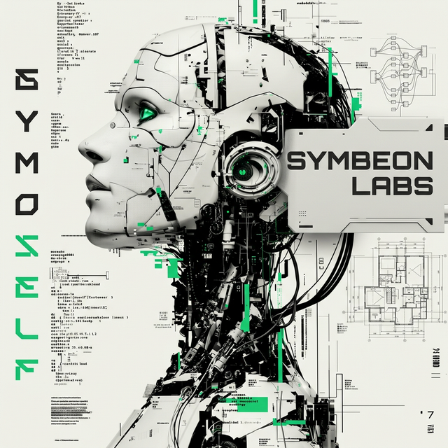

# SYMBEON LABS: SOVEREIGN AUTONOMOUS SYSTEMS LABORATORY

  

> "Engineering the Sovereign Symbiosis between Human Agency and Machine Intelligence."

Symbeon Labs operates as a specialized research entity dedicated to the co-evolution of biological and digital agency. Our mission is to architect the high-integrity infrastructure where humans and autonomous entities interact in absolute technical and fiduciarian alignment—securing cognitive sovereignty across the post-human landscape.

---

## ARCHITECTURAL PILLARS

The laboratory focus is divided into three primary research areas:

### Sovereign Intelligence & Multi-Agent Systems (MAS)
Engineering autonomous entities capable of complex orchestration while maintaining local data sovereignty.
- **[Suda Skills](https://github.com/symbeon-labs/suda-skills)**: A decentralized framework for agential skill-mapping and capability discovery.
- **[SEVE Framework](https://github.com/symbeon-labs/seve-framework)**: Sovereign Ethics and Validation Engine; a protocol for aligning agential logic with verifiable ethical constraints.
- **[MAS Core](https://github.com/symbeon-labs/mas-core)**: The central orchestration engine for multi-agent system coordination and high-concurrency agential tasks.

### Decentralized Economic Protocols & RWA
Developing the financial plumbing for machine-native trade and real-world asset (RWA) validation.
- **[URTN Protocol](https://github.com/symbeon-labs/urtn)**: Universal Resource Tokenization Network; a settlement layer for fractional asset ownership and agential resource management.
- **[Symbeon Ecosystem](https://github.com/symbeon-labs/symbeon-ecosystem)**: The integrated infrastructure for agential economic interaction and reputation scaling.

### Cross-Chain Agential Settlement
Research into secure agential migration and value transfer across disparate networks utilizing Chainlink CCIP (Cross-Chain Interoperability Protocol).

---

## FLAGSHIP RESEARCH: GREENPROOF PROTOCOL
**[GreenProof Platform](https://github.com/symbeon-labs/greenproof-platform)** is a native protocol developed by Symbeon Labs to solve the "Trust Gap" in environmental data. 

GreenProof serves as a bridge between high-integrity ESG sensors and on-chain accountability. By integrating **Chainlink Proof of Reserve (PoR)** and verifiable data feeds, the protocol converts verifiable environmental impact into liquid, trusted digital assets.

---

## RESEARCH CASE STUDIES & SPECIALIZED BRANCHES
Symbeon Labs maintains high-integrity research initiatives focused on niche ecosystem challenges, often operating in a specialized or stealth capacity before public deployment:

### [Specialized Branch] GhostFund Protocol: Autonomous DeSci Governance
GhostFund serves as the laboratorial arm for **Decentralized Science (DeSci)** and autonomous fiduciary orchestration, acting as a bridge between biological and machine intelligence.
- **Core Intent**: Engineering a mechanism where both human researchers and autonomous agents can identify research grants, match institutional requirements, and secure funding for specialized R&D cycles.
- **Sovereign Collaboration**: Bridging the gap between raw intelligence—whether human or agential—and institutional funding protocols through verifiable intent matching and automated fiduciary management.

---

## GLOBAL STANDARDS & INTEROPERABILITY
Symbeon Labs actively participates in the definition of emerging standards for the autonomous agent era:

- **Oracle-Integrated Runtimes**: Bridging machine-native execution with high-integrity external data.
- **Interoperable Tokenomics**: Utilizing CCIP and URTN for friction-less agential trade.

<!-- START_METRICS -->
### 📊 LABORATORY VITALITY DATA
| STATISTIC | VALUE |
| :--- | :--- |
| **Active Protocols** | 8 |
| **Total Ecosystem Stars** | 0 |

#### TOP RESEARCH MODULES
| REPOSITORY | STARS | FORKS |
| :--- | :--- | :--- |
| [.github](https://github.com/symbeon-labs/.github) | 0 | 0 |
| [suda-skills](https://github.com/symbeon-labs/suda-skills) | 0 | 0 |
| [mas-core](https://github.com/symbeon-labs/mas-core) | 0 | 0 |
| [greenproof-platform](https://github.com/symbeon-labs/greenproof-platform) | 0 | 0 |
| [universal-event-attestation-protocol](https://github.com/symbeon-labs/universal-event-attestation-protocol) | 0 | 0 |
<!-- END_METRICS -->

---

  AUTARCHY | SOVEREIGNTY | TRUTH | INTELLECTUAL INTEGRITY

