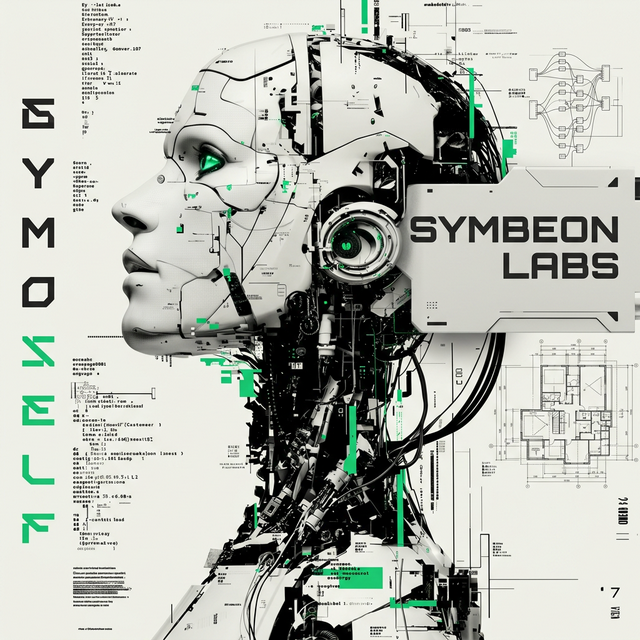

# SYMBEON LABS

## Applied Research for Computable Organizations

  

> We investigate real operations, turn evidence into operational intelligence, and build the infrastructure that makes organizations computable.

Symbeon Labs is an applied research and engineering laboratory focused on understanding how organizations operate and building systems that improve how they observe, decide, execute, and learn.

Our work sits at the intersection of:

- Artificial Intelligence
- Operational Intelligence
- Data & Analytics
- Software Infrastructure
- Agentic Systems
- Computational Governance
- Verifiable Evidence

---

## OUR APPROACH

We do not begin with a technology.

We begin with reality.

**Observe → Map → Evidence → Model → Intervene → Measure → Learn**

We investigate operational environments, map their processes and information, collect evidence, build models of how they work, and develop the appropriate technical interventions.

**The technology comes after understanding the system.**

---

## MAKING ORGANIZATIONS COMPUTABLE

Organizations are complex systems composed of:

- decisions
- processes
- people
- data
- dependencies
- policies
- evidence
- knowledge
- actions

Our research explores how these elements can be represented computationally, connected through evidence, and transformed into systems capable of supporting better execution, governance, and learning.

The goal is not simply to automate organizations.

It is to make their operations **observable, traceable, understandable, and increasingly computable.**

---

## FROM RESEARCH TO INFRASTRUCTURE

Our work follows a continuous cycle:

**Reality → Evidence → Intelligence → Intervention → Learning**

Research produces models.

Models become infrastructure.

Infrastructure enables new forms of operation.

Operations generate new evidence.

That evidence feeds the next cycle of research.

This creates a feedback loop between **investigation, engineering, and real-world operation.**

---

## RESEARCH AREAS

### Operational Intelligence
Understanding how real operations work and transforming operational data and evidence into actionable intelligence.

### Artificial Intelligence & Agents
Developing intelligent systems capable of reasoning, acting, coordinating, and operating within structured environments.

### Computational Governance
Exploring how organizational rules, decisions, dependencies, and evidence can become explicit and machine-readable.

### Verifiable Systems
Building mechanisms for evidence, provenance, traceability, and verifiable operational state.

### Organizational Computing
Studying organizations as computational systems that can be modeled, observed, and continuously improved.

---

## OUR PRINCIPLE

> **Evidence before intervention.**

Understand before proposing.

Investigate before developing.

Measure before concluding.

Learn before scaling.

---

## THE LABORATORY

Symbeon Labs is not defined by a single product or technology.

It is defined by a method:

**Understand reality.**  
**Model it.**  
**Build what matters.**  
**Measure the result.**  
**Learn from the system.**

---

  Applied research. Operational intelligence. Computable organizations.

